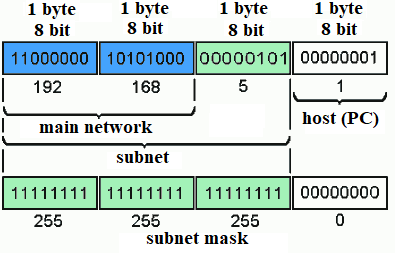
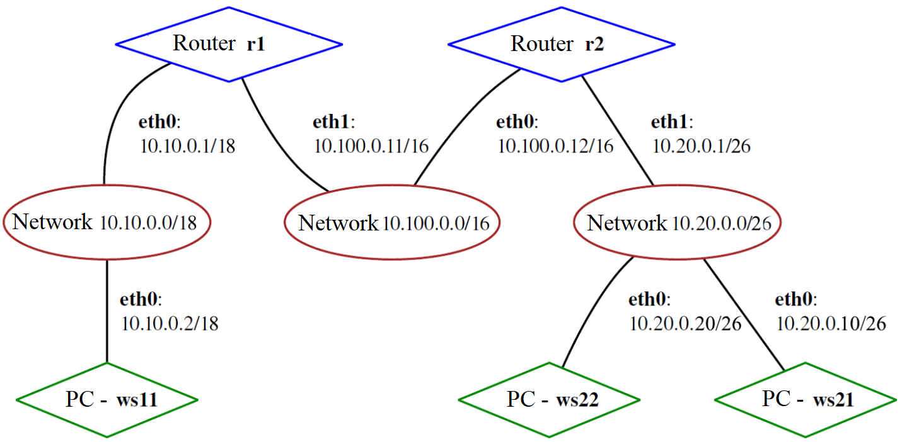

# Linux Network

Linux networks configuration on virtual machines.

The russian version of the task can be found in the repository.

## Contents

1. [Chapter I](#chapter-i)
2. [Chapter II](#chapter-ii) \
   2.1. [TCP IP protocol stack](#tcp-ip-protocol-stack) \
   2.2. [Addressing](#addressing) \
   2.3. [Routing](#routing)
3. [Chapter III](#chapter-iii) \
   3.1. [ipcalc tool](#ipcalc-tool) \
   3.2. [Static routing between two machines](#part-2-static-routing-between-two-machines) \
   3.3. [iperf3 utility](#part-3-iperf3-utility) \
   3.4. [Network firewall](#part-4-network-firewall) \
   3.5. [Static network routing](#part-5-static-network-routing) \
   3.6. [Dynamic IP configuration using DHCP](#part-6-dynamic-ip-configuration-using-dhcp) \
   3.7. [NAT](#part-7-nat) \
   3.8. [Bonus. Introduction to SSH Tunnels](#part-8-bonus-introduction-to-ssh-tunnels)
4. [Chapter IV](#chapter-iv)

## Chapter I


Planet Earth, USA, California, Compton, Seb's Jazz Club, nowadays.

\> *There's a new jazz band playing at the bar. Their jazz is a little more energetic than you're used to, although they're certainly talented.*

`—` Sebastian, you have been sitting behind a desk in the office for a week now. Do you think you've learned how to use Linux? But given that you called me again in the middle of the week, I think I already know the answer...

`—` I'm slowly getting the hang of it, but obviously not as quickly as I'd like.

`—` Are you ready to go to work tomorrow?

`—` I don't get it, I just don't get it, man. They tell me to work on configuration of networks. But to me it's just words. I want to meet my young self when I was a stupid kid who took the job as a sysadmin, talk him out of it, explain what's what, but I can't. What should I do, buddy?

`—` Well, come on, you shouldn't despair. Configuring networks isn't so bad. I'd be happy to tell you about it if you answer one question: why did your father get you the job as a sysadmin anyway? I mean, this is his bar, why not here? That would be an easier job.

`—` Who knows what's on the old man's mind. He says something about being independent and broadening your mind...

`—` Well, then, let's keep broadening your mind. Get your laptop out, start the virtual machine, I'll show you what's what.

\> *The regular band replace the new one, the music slows down and the waiter still hasn’t brought your order.*

\> *While Sebastian is hesitatingly start the virtual machine, you decide to share some basic information about networks in Linux.*


## Chapter II
### TCP IP protocol stack

What exactly is a network? A network is a connection of at least 2 computers by some kind of communication links or in a more complicated cases, by some networking hardware. The data is exchanged between them according to certain rules, and these rules are "dictated" by the **TCP/IP** protocol stack.

TCP/IP stands for Transmission Control Protocol/Internet Protocol and, to put it simply, is a set of communication protocols of different layers (each layer communicates with its neighbor, i.e. docks, hence the name stack), according to which data is exchanged in a network.
So, the protocol stack **TCP/IP** is a set of rule sets :) This may raise a fair question: why have so many protocols? Can't everything be exchanged over one protocol?

The thing is that each protocol describes strictly the rules that are allocated to it. Besides, protocols are divided into functionality layers, allowing networking hardware and software to perform much more simply, clearer and to do "their" range of tasks.
There was developed an **OSI** model (Open Systems Interconnection Basic Reference Model) in 1978 to divide this set of protocols into layers.
The **OSI** model consists of seven different layers. Each layer is responsible for a specific area in the operation of the communication systems, it does not depend on the layers next to it - it only provides certain services. Each layer performs its task according to a set of rules, called a protocol.

### Addressing

In a network based on the **TCP/IP** protocol stack, each host (computer or device connected to the network) has an IP address. IP address is 32-bit number. It is usually represented in dot-decimal notation, consisting of four decimal numbers, each ranging from 0 to 255, separated by dots, e.g., *192.168.0.1*.
In general, an IP address is divided into two parts: the network (subnet) address and the host address:



As you can see in the picture, there are such things as network and subnet.
I think it's clear from the meaning of those words that IP addresses are divided into networks, and networks are divided into subnets using a subnet mask
(it would be more accurate to say: a host address can be divided into subnets).

Apart from the host address in a **TCP/IP** network, there is such a thing as a port. A port is a numerical characteristic of some system resource.
A port is given to an application running on some network host to communicate with applications running on other network hosts (including other applications on the same host). In software terms, a port is an area of memory that is controlled by a service.

The IP protocol lies below **TCP** and **UDP** in the protocol hierarchy and is responsible for transmitting and routing information in a network.
To do this, IP encapsulates each chunk of information (**TCP** or **UDP** packet) in another packet - an IP packet or IP datagram, which stores a header about the source, destination and route.

To draw an analogy with the real world, a **TCP/IP** network is a city. The names of streets and alleys are networks and subnets. The building numbers are the addresses of the hosts.
In buildings, office/apartment numbers are ports. More precisely, the ports are the mailboxes where the recipients (services) are waiting for their correspondence to arrive. Accordingly, office port numbers 1,2 etc. are usually given to directors and executives, as the privileged ones, and ordinary employees get office numbers with larger numbers. For sending and delivering correspondence, information is packed into envelopes (ip-packets),
which contain the address of the sender (ip and port) and the address of the recipient (ip and port).

It must be mentioned that the IP protocol has no notion of ports, **TCP** and **UDP** are responsible for port interpretation, by analogy **TCP** and **UDP** do not process IP addresses.

### Routing


You may ask, how does one computer connect to another one? How does it know where to send packets?

To resolve this issue, networks are linked by gateways (routers).
A gateway is the same as a host but with a connection to two or more networks and can transfer information between networks and send packets to another network.
In the picture the gateway is pineapple and papaya with 2 interfaces each connected to different networks.

IP uses the network part of the address (subnet mask) to determine the route of packets.
To determine the route, each computer in the network has a routing table that maintains a list of networks and gateways for these networks.
The IP "reads" the network part of the destination address in a passing packet and if there is an entry in the routing table for that network, the packet is sent to the corresponding gateway.

In Linux, the operating system kernel stores the routing table in the */proc/net/route* file.
You can view the current routing table with the `netstat -rn` (r - routing table, n - do not convert IP to names) `route` or `ip r` commands.

Here is an example of a routing table for an eggplant host:
```
[root@eggplant ~]# netstat -rn
Kernel IP routing table
Destination     Gateway         Genmask         Flags   MSS Window  irtt Iface
128.17.75.0      128.17.75.20   255.255.255.0   UN        1500 0          0 eth0
default          128.17.75.98   0.0.0.0         UGN       1500 0          0 eth0
127.0.0.1        127.0.0.1      255.0.0.0       UH        3584 0          0 lo
128.17.75.20     127.0.0.1      255.255.255.0   UH        3584 0          0 lo
```

Meanings of the columns:
- Destination - addresses of destination networks (hosts). If a network is specified, the address usually ends with a zero.
- Gateway - the gateway address for the host/network specified in the first column. The third column is the subnet mask for which this route works.
- Flags - information about destination address (U - route works, N - route for network, H - route for host, etc.)
- MSS - number of bytes that can be sent at one time
- Window - number of frames that can be sent before confirmation is received
- irtt - route usage statistics
- Iface - specifies the network interface used for the route (eth0, eth1, etc.)

\> *As last time, you save even more useful information in the materials folder*

## Chapter III

As a result of the work you should provide a report with completed tasks. Each part of the task describe what should be added to the report once it has been completed. This can be answers to questions, screenshots, etc.
- A report with a .md extension must be uploaded to the repository, in the src folder.
- All parts of the task should be highlighted in the report as level 2 headings.
- Within one part of the task, everything that is added to the report must be in the form of the list.
- Each screenshot in the report must be briefly captioned (what’s in the screenshot).
- All screenshots must be cropped so that only the relevant part of the screen is shown.
- It’s allowed to have several task points shown in one screenshot, but they must all be described in the caption.
- Install **Ubuntu 20.04 Server LTS** on all virtual machines created during the task.

## Part 1. **ipcalc** tool

`-` So, let's start our dive into the wonderful world of networks by getting to know IP addresses. And for that we will use **ipcalc** tool.

**== Task ==**

##### Start a virtual machine (hereafter -- ws1)

#### 1.1. Networks and Masks
##### Define and write in the report:
##### 1) Network address of *192.167.38.54/13*
##### 2) Conversion of the mask *255.255.255.0* to prefix and binary, */15* to normal and binary, *11111111.11111111.11111111.11110000* to normal and prefix
##### 3) Minimum and maximum host in *12.167.38.4* network with masks: */8*, *11111111.11111111.00000000.00000000*, *255.255.254.0* and */4*

#### 1.2. localhost
##### Define and write in the report whether an application running on localhost can be accessed with the following IPs: *194.34.23.100*, *127.0.0.2*, *127.1.0.1*, *128.0.0.1*

#### 1.3. Network ranges and segments
##### Define and write in a report:
##### 1) which of the listed IPs can be used as public and which only as private: *10.0.0.45*, *134.43.0.2*, *192.168.4.2*, *172.20.250.4*, *172.0.2.1*, *192.172.0.1*, *172.68.0.2*, *172.16.255.255*, *10.10.10.10*, *192.169.168.1*
##### 2) which of the listed gateway IP addresses are possible for *10.10.0.0/18* network: *10.0.0.1*, *10.10.0.2*, *10.10.10.10*, *10.10.100.1*, *10.10.1.255*

## Part 2. Static routing between two machines

`-` Now let's figure out how to connect two machines using static routing.

**== Task ==**

##### Start two virtual machines (hereafter -- ws1 and ws2)

##### View existing network interfaces with the `ip a` command
- Add a screenshot with the call and output of the used command to the report.
##### Describe the network interface corresponding to the internal network on both machines and set the following addresses and masks: ws1 - *192.168.100.10*, mask */16 *, ws2 - *172.24.116.8*, mask */12*
- Add screenshots of the changed *etc/netplan/00-installer-config.yaml* file for each machine to the report.
##### Run the `netplan apply` command to restart the network service
- Add a screenshot with the call and output of the used command to the report.

#### 2.1. Adding a static route manually
##### Add a static route from one machine to another and back using a
`ip r add` command.
##### Ping the connection between the machines
- Add a screenshot with the call and output of the used commands to the report.

#### 2.2. Adding a static route with saving
##### Restart the machines
##### Add static route from one machine to another using *etc/netplan/00-installer-config.yaml* file
- Add screenshots of the changed *etc/netplan/00-installer-config.yaml*
  file to the report.
##### Ping the connection between the machines
- Add a screenshot with the call and output of the used command to the report.

## Part 3. **iperf3** utility

`-` Now that we have linked two machines, tell me: What is the most important thing about transferring information between machines?

`-` The connection speed?

`-` That's right. We’ll check it with **iperf3** utility.

**== Task ==**

* In this task you need to use ws1 and ws2 from *Part 2*.

#### 3.1. Connection speed
##### Convert and write results in the report: 8 Mbps to MB/s, 100 MB/s to Kbps, 1 Gbps to Mbps

#### 3.2. **iperf3** utility
##### Measure connection speed between ws1 and ws2
- Add a screenshots with the call and output of the used commands to the report.

## Part 4. Network firewall

`-` After connecting the machines, the next our task is to control the information flowing over the connection. For that we use firewalls.

**== Task ==**

* In this task you need to use ws1 and ws2 from *Part 2*.

#### 4.1. **iptables** utility
##### Create a */etc/firewall.sh* file simulating the firewall on ws1 and ws2:
```shell
#!/bin/sh

# Deleting all the rules in the "filter" table (default).
iptables -F
iptables –X
```
##### The following rules should be added to the file in a row:
##### 1) on ws1 apply a strategy where a deny rule is written at the beginning and an allow rule is written at the end (this applies to points 4 and 5)
##### 2) on ws2 apply a strategy where an allow rule is written at the beginning and a deny rule is written at the end (this applies to points 4 and 5)
##### 3) open access on machines for port 22 (ssh) and port 80 (http)
##### 4) reject *echo reply* (machine must not ping, i.e. there must be a lock on OUTPUT)
##### 5) allow *echo reply* (machine must be pinged)
- Add screenshots of the */etc/firewall* file for each machine to the report.
##### Run the files on both machines with `chmod +x /etc/firewall.sh` and `/etc/firewall.sh` commands.
- Add screenshots of both files running to the report.
- Describe in the report the difference between the strategies used in the first and second files.

#### 4.2. **nmap** utility
##### Use **ping** command to find a machine which is not pinged, then use **nmap** utility to show that the machine host is up
*Check: nmap output should say: `Host is up`*.
- Add screenshots with the call and output of the **ping** and **nmap** commands to the report.

##### Save dumps of the virtual machine images
**p.s. Do not upload dumps to git under any circumstances!**


## Part 5. Static network routing

`-` So far we have only connected two machines, but now it's time for static routing of the whole network.

**== Task ==**

Network: \


##### Start five virtual machines (3 workstations (ws11, ws21, ws22) and 2 routers (r1, r2))

#### 5.1. Configuration of machine addresses
##### Set up the machine configurations in *etc/netplan/00-installer-config.yaml* according to the network in the picture.
- Add screenshots of the *etc/netplan/00-installer-config.yaml* file for each machine to the report.
##### Restart the network service. If there are no errors, check that the machine address is correct with the `ip -4 a`command. Also ping ws22 from ws21. Similarly ping r1 from ws11.
- Add screenshots with the call and output of the used commands to the report.

#### 5.2. Enabling IP forwarding.
##### To enable IP forwarding, run the following command on the routers:
`sysctl -w net.ipv4.ip_forward=1`.

*With this approach, the forwarding will not work after the system is rebooted.*
- Add a screenshot with the call and output of the used command to the report.

##### Open */etc/sysctl.conf* file and add the following line:
`net.ipv4.ip_forward = 1`
*With this approach, IP forwarding is enabled permanently.*
- Add a screenshot of the changed */etc/sysctl.conf* file to the report.

#### 5.3. Default route configuration
Here is an example of the `ip r' command output after adding a gateway:
```
default via 10.10.0.1 dev eth0
10.10.0.0/18 dev eth0 proto kernel scope link src 10.10.0.2
```

##### Configure the default route (gateway) for the workstations. To do this, add `default` before the router's IP in the configuration file
- Add a screenshot of the *etc/netplan/00-installer-config.yaml* file to the report.
##### Call `ip r` and show that a route is added to the routing table
- Add a screenshot with the call and output of the used command to the report.
##### Ping r2 router from ws11 and show on r2 that the ping is reaching. To do this, use the `tcpdump -tn -i eth1`
command.
- Add screenshots with the call and output of the used commands to the report.

#### 5.4. Adding static routes
##### Add static routes to r1 and r2 in configuration file. Here is an example for r1 route to 10.20.0.0/26:
```shell
# Add description to the end of the eth1 network interface:
- to: 10.20.0.0
  via: 10.100.0.12
```

- Add screenshots of the changed *etc/netplan/00-installer-config.yaml* file for each router to the report.

##### Call `ip r` and show route tables on both routers. Here is an example of the r1 table:
```
10.100.0.0/16 dev eth1 proto kernel scope link src 10.100.0.11
10.20.0.0/26 via 10.100.0.12 dev eth1
10.10.0.0/18 dev eth0 proto kernel scope link src 10.10.0.1
```
- Add a screenshot with the call and output of the used command to the report.
##### Run `ip r list 10.10.0.0/[netmask]` and `ip r list 0.0.0.0/0` commands on ws11.
- Add a screenshot with the call and the output of the used commands to the report.
- Explain in the report why a different route other than 0.0.0.0/0 had been selected for 10.10.0.0/\[netmask\] although it could be the default route.

#### 5.5. Making a router list
Here is an example of the **traceroute** utility output after adding a gateway:
```
1 10.10.0.1 0 ms 1 ms 0 ms
2 10.100.0.12 1 ms 0 ms 1 ms
3 10.20.0.10 12 ms 1 ms 3 ms
```
##### Run the `tcpdump -tnv -i eth0` dump command on r1
##### Use **traceroute** utility to list routers in the path from ws11 to ws21
- Add a screenshots with the call and the output of the used commands (tcpdump and traceroute) to the report.
- Based on the output of the dump on r1, explain in the report how path construction works using **traceroute**.

#### 5.6. Using **ICMP** protocol in routing
##### Run on r1 network traffic capture going through eth0 with the
`tcpdump -n -i eth0 icmp` command.

##### Ping a non-existent IP (e.g. *10.30.0.111*) from ws11 with the
`ping -c 1 10.30.0.111` command.
- Add a screenshot with the call and the output of the used commands to the report.

##### Save dumps of the virtual machine images
**p.s. Do not upload dumps to git under any circumstances!**

## Part 6. Dynamic IP configuration using **DHCP**

`-` Our next step is to learn more about **DHCP** service, which you already know.

**== Task ==**

*In this task you need to use virtual machines from Part 5*

##### For r2, configure the **DHCP** service in the */etc/dhcp/dhcpd.conf* file:

##### 1) specify the default router address, DNS-server and internal network address. Here is an example of a file for r2:
```shell
subnet 10.100.0.0 netmask 255.255.0.0 {}

subnet 10.20.0.0 netmask 255.255.255.192
{
    range 10.20.0.2 10.20.0.50;
    option routers 10.20.0.1;
    option domain-name-servers 10.20.0.1;
}
```
##### 2) Write `nameserver 8.8.8.8.` in a *resolv.conf* file
- Add screenshots of the changed files to the report.
##### Restart the **DHCP** service with `systemctl restart isc-dhcp-server`. Reboot the ws21 machine with `reboot` and show with `ip a` that it has got an address. Also ping ws22 from ws21.
- Add a screenshot with the call and the output of the used commands to the report.

##### Specify MAC address at ws11 by adding to *etc/netplan/00-installer-config.yaml*:
`macaddress: 10:10:10:10:10:BA`, `dhcp4: true`
- Add a screenshot of the changed *etc/netplan/00-installer-config.yaml* file to the report.
##### Сonfigure r1 the same way as r2, but make the assignment of addresses strictly linked to the MAC-address (ws11). Run the same tests
- Describe this part in the report the same way as for r2.
##### Request ip address update from ws21
- Add screenshots of ip before and after update to the report
- Describe in the report what **DHCP** server options were used in this point.

##### Save dumps of virtual machine images
**p.s. Do not upload dumps to git under any circumstances!**

## Part 7. **NAT**

And finally, the cherry on the cake, let me tell you about network address translation mechanism.

**== Task ==**

*In this task you need to use virtual machines from Part 5*

##### In */etc/apache2/ports.conf* file change the line `Listen 80` to `Listen 0.0.0.0:80`on ws22 and r1, i.e. make the Apache2 server public
- Add a screenshot of the changed file to the report
##### Start the Apache web server with `service apache2 start` command on ws22 and r1
- Add screenshots with the call and the output of the used command to the report.

##### Add the following rules to the firewall, created similarly to the firewall from Part 4, on r2:
##### 1) Delete rules in the filter table - `iptables -F`
##### 2) Delete rules in the "NAT" table - `iptables -F -t nat`
##### 3) Drop all routed packets - `iptables --policy FORWARD DROP`
##### Run the file as in Part 4
##### Check the connection between ws22 and r1 with the `ping` command
*When running the file with these rules, ws22 should not ping from r1*
- Add screenshots with the call and the output of the used command to the report.
##### Add another rule to the file:
##### 4) Allow routing of all **ICMP** protocol packets
##### Run the file as in Part 4
##### Check connection between ws22 and r1 with the `ping` command
*When running the file with these rules, ws22 should ping from r1*
- Add screenshots with the call and the output of the used command to the report.
##### Add two more rules to the file:
##### 5) Enable **SNAT**, which is masquerade all local ip from the local network behind r2 (as defined in Part 5 - network 10.20.0.0)
*Tip: it is worth thinking about routing internal packets as well as external packets with an established connection*
##### 6) Enable **DNAT** on port 8080 of r2 machine and add external network access to the Apache web server running on ws22
*Tip: be aware that when you will try to connect, there will be a new tcp connection for ws22 and port 80
- Add a screenshot of the changed file to the report
##### Run the file as in Part 4
*Before testing it is recommended to disable the **NAT** network interface in VirtualBox (its presence can be checked with `ip a` command), if it is enabled*
##### Check the TCP connection for **SNAT** by connecting from ws22 to the Apache server on r1 with the `telnet [address] [port]` command
##### Check the TCP connection for **DNAT** by connecting from r1 to the Apache server on ws22 with the `telnet` command (address r2 and port 8080)
- Add screenshots with the call and the output of the used commands to the report.

##### Save dumps of virtual machine images
**p.s. Do not upload dumps to git under any circumstances!**

## Part 8. Bonus. Introduction to **SSH Tunnels**

`-` Well, that'll be all for now. Do you have any other questions?

`-` Yes, I wanted to ask about one more thing. When I was at work, I overheard that there are some kind of training projects in my company. I don't know the details, but I'd really like to take a look... It might be useful.

`-` Yes, it's really interesting, but how can I help you with that?

`-` The problem is that you need to have an access to a closed network to get to these projects. Can you give me any advice on that?

`-` Wow, that’s really something… I'm not sure how much help this will be, but I can tell you about **SSH Tunnels**.

**== Task ==**

*In this task you need to use virtual machines from Part 5*

##### Run a firewall on r2 with the rules from Part 7
##### Start the **Apapche** web server on ws22 on localhost only (i.e. in */etc/apache2/ports.conf* file change the line `Listen 80` to `Listen localhost:80`)
##### Use *Local TCP forwarding* from ws21 to ws22 to access the web server on ws22 from ws21
##### Use *Remote TCP forwarding* from ws11 to ws22 to access the web server on ws22 from ws11
##### To check if the connection worked in both of the previous steps, go to a second terminal (e.g. with the Alt + F2) and run the `telnet 127.0.0.1 [local port]` command.
- In the report, describe the commands that you need for doing these 4 steps and add screenshots of their call and output.

##### Save dumps of virtual machine images
**p.s. Do not upload dumps to git under any circumstances!**

## Chapter IV

`-` Thank you so much for the help!

`-` You’re welcome! It was good for me to remember the basics of administration too. By the way, I’ve decided to go into DevOps.

`-` Wow! Have you found a job yet?

`-` Yes, but I’ll have to move. So, next time you'll have to learn everything on your own.

`-` Sooner or later I'd have to start anyway, so maybe it's for the best. Stay in touch to tell me about how you’re getting on!

`-` You too!

\> *You talk about other things for a while, listening to some nice music and finishing your drinks, and then you say goodbye...*.

💡 [Tap here](https://forms.yandex.ru/u/6357f46743f74f34ac973d8d/) **to leave your feedback on the project**. Pedago Team really tries to make your educational experience better.
