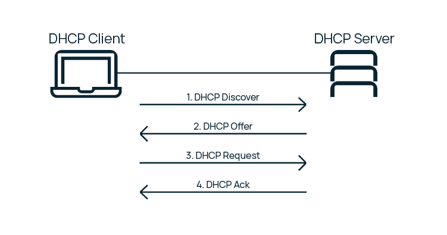

## **DHCP** Protocol

**DHCP** is a TCP/IP model application layer protocol used to assign an IP address to a client. An IP address can be manually assigned to each client, i.e. to a computer within a local network. But in large networks it’s very time-consuming and moreover, the larger the local network, the higher the chance of configuration error. This is why the **DHCP** protocol was created to automate IP assignment.

It takes four steps to get an address.
This process is called *DORA* by the first letters of each step:
- Discovery
- Offer
- Request
- Acknowledgement



#### **DHCP** Options

The client needs not only the IP but also other **DHCP** options for networking - such as subnet mask, default gateway and server address. Options represent numbered points, lines of data that contain the configuration parameters required by the server client.

Let's describe some of the options:
- Option 1 - IP subnet mask;
- Option 3 - the default gateway;
- Option 6 - DNS server address (primary and backup);
- Option 51 defines for how long the IP address is leased to the client;
- Option 55 is the list of requested options. The client always requests options for the correct configuration. By sending a message with Option 55, the client sets the list of requested option numeric codes in order of preference. **DHCP** server tries to send a response with options in the same order.

##  Force **DHCP** Client (**dhclient**) to renew IP address

You need to use Dynamic Host Configuration Protocol Client i.e., dhclient command.
The client normally doesn’t release the current lease as it is not required by the DHCP protocol.
Some cable ISPs require their clients to notify the server if they wish to release an assigned IP address.
The **dhclient** command, provides a means for configuring one or more network interfaces using the Dynamic Host Configuration Protocol, BOOTP protocol, or if these protocols fail, by statically assigning an address.
Let's see Linux command to force DHCP client release IP address.

*Warning: Releasing your IP address always brings down your network interface/WiFi.
So be careful with remote systems.*

The *-r* flag explicitly releases the current lease, and once the lease has been released, the client exits.
For example, open terminal application and type the command:
```shell
$ sudo dhclient -r
```

Now obtain fresh IP address using **DHCP** on Linux:
```shell
$ sudo dhclient
```

To renew or release an IP address for the concrete interface, for example eth0, enter:
```shell
$ sudo dhclient -r eth0
$ sudo dhclient eth0
```
