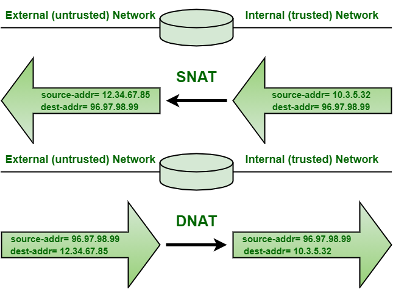

## **SNAT** and **DNAT**

**NAT** is an abbreviation for Network Address Translation.
**NAT** occurs when one of the IP addresses in an IP packet header is changed i.e. either Source IP address or Destination IP address.

PARAMETER|	**SNAT**|	**DNAT**
---------|----------|-----------
Abbreviation for |Source **NAT**|Destination **NAT**
Terminology|**SNAT** changes the private IP address of the source host to public IP address. It may also change the source port in the TCP/UDP headers. **SNAT** is typically used by internal users to access the Internet. |Destination **NAT** changes the destination address in IP header of a packet. It may also change the destination port in the TCP/UDP headers. **DNAT** is used when we need to redirect incoming packets with a destination of a public address/port to a private IP address/port inside your network.
Use Case |A client Inside LAN and behind Firewall wanted to browse Internet|A Website Hosted inside Data Center behind the Firewall and needs to be accessible to users over Internet
Address Change|**SNAT** changes the source address of packets passing through **NAT** device|**DNAT** changes the destination address of packets passing through the Router
Order of Operation|**SNAT** is performed after the routing decision is made.|**DNAT** is performed before the routing decision is made.
Communication Flow|When inside secured Network initiates communicates with outside world, **SNAT** happens|When outside insecured Network initiates communication with inside secured Network, **DNAT** happens
Single/Multiple hosts|**SNAT** allows multiple hosts on the “inside” network to get to any host on the “outside” network|**DNAT** allows any host on the “outside” network to get to a single host on the “inside” network
