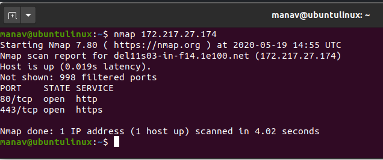

## **iptables**

**iptables** is a command-line firewall utility that uses policy chains to allow or block traffic.
When a connection tries to establish itself on your system, **iptables** looks for a rule in its list to match it to.
If it doesn’t find one, it resorts to the default action.

## **nmap**

Nmap is Linux command-line tool for network exploration and security auditing.
This tool is generally used by hackers and cybersecurity enthusiasts and even by network and system administrators.
It is used for the following purposes:
- Real time information of a network
- Detailed information of all the IPs activated on your network
- Number of ports open in a network
- Provide the list of live hosts
- Port, OS and Host scanning

The most common usage of nmap is to scan a system with hostname or IP address.
Here is an example of scan using IP address:

One of the features of **nmap** is that this utility can detect whether a host is enabled, even if it cannot be pinged.
