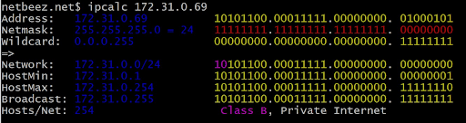
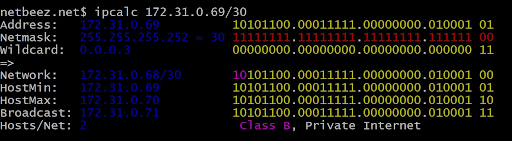
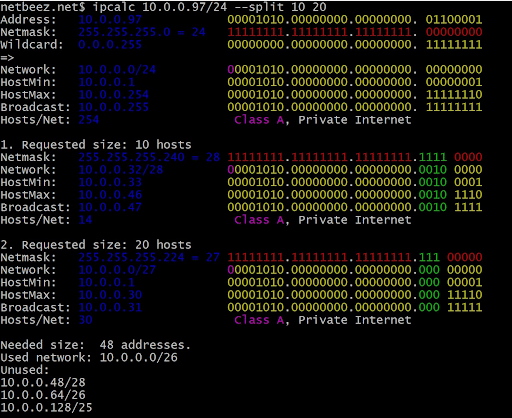

## Addressing. Continuation

#### IP Classification

There are classifications of IP addresses as "private" and "public". The following ranges of addresses are reserved for private (aka LAN) networks:
- *10.0.0.0* — *10.255.255.255* (*10.0.0.0/8*),
- *172.16.0.0* — *172.31.255.255* (*172.16.0.0/12*),
- *192.168.0.0* — *192.168.255.255* (*192.168.0.0/16*).
- *127.0.0.0* — *127.255.255.255* (Reserved for loopback interfaces (not used for communication between network nodes), so called localhost)

#### Ports

The standard defines for each of the **TCP** and **UDP** protocols the ability to simultaneously allocate up to 65536 unique ports on a host,
identified by numbers from 0 to 65535.
The whole range of ports is divided into 3 groups:
- 0 to 1023 are called privileged or reserved (used for system and some popular programs)
- 1024 to 49151 are called registered ports.
- 49152 to 65535 are called dynamic ports.

## **ipcalc**

**ipcalc** is a utility that can perform simple manipulations of IPv4 addresses.
If you just type **ipcalc** without any input option, it will give you a nice ‘help’ output with some examples which are very helpful to get you started.

#### **ipcalc** Examples

Let’s look at some examples. If you give the IPv4 address as the input of your host, you will get the following output:

**ipcalc** picks up the netmask of the host and the output is pretty self explanatory.
The nice thing about **ipcalc** is that it gives the binary equivalents for each address which helps you to better visualize it.

The gap in the binary representation separates the network and the host part of the address.

You can also give the netmask as input, and here is a simple example of that:

Unfortunately, you can't give binary form of address as input of **ipcalc** :(

##### Subnets

One of the most useful capabilities of ipcalc is its ability to calculate network segments. Here is an example of how this works when we want to assign 10 and 20 addresses to two different subnets:

