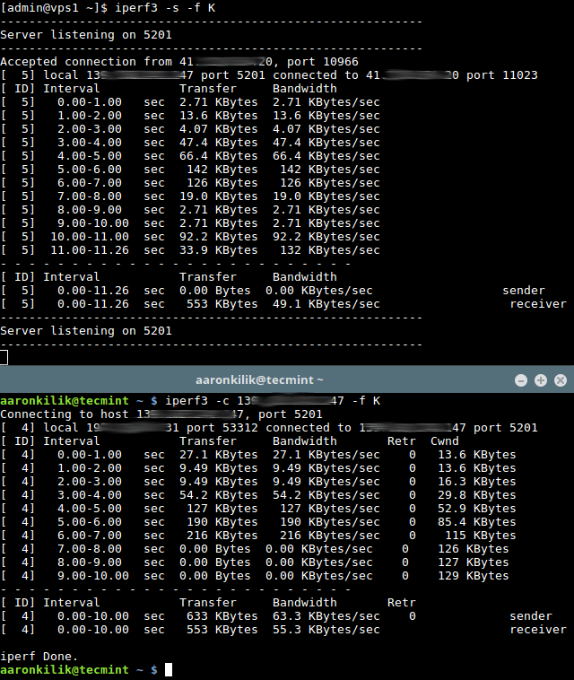

## Connection speed

The basic unit of information transfer rate is bits per second (bps).

The difference between bytes per second (B/s) and bps is the same as the difference between bytes and bits: 1 B/s = 8 bps.

Similarly, the difference between kilobytes per second (KB/s) and B/s is the same as the difference between kilobytes and bytes: 1 KB/s = 1024 B/s. And so on.

## **iperf3**

**iperf3** is a program for performing real-time network throughput measurements.
It is one of the powerful tools for testing the maximum achievable bandwidth in IP networks (supports IPv4 and IPv6).

To test network throughput you need at first connect to the remote machine which you will use as the server and fire up **iperf3** in server mode using *-s* flag, it will listen on port 5201 by default.

You can specify the format *(k, m, g for Kbits, Mbits, Gbits or K, M, G for KBytes, Mbytes, Gbytes)* to report in, using the *-f* switch as shown.
```iperf3 -s -f K```

Optionally, you can run the server as a daemon, using the *-D* flag and write server messages to a log file, as follows.
```iperf3 -s -D > iperf3log```

Then on your local machine which we will treat as the client (where the actual benchmarking takes place),
run **iperf3** in client mode using *-c* flag and specify the host on which the server is running on (either using its IP address or domain or hostname).
```iperf3 -c 192.168.10.1 -f K```

After about 18 to 20 seconds, the client should terminate and produce results indicating the average throughput for the benchmark, as shown in the following screenshot.



Important: From the benchmark results, as shown in the above screenshot, there is a variation in values from the server and client.
But, you should always consider using the results obtained from the **iperf3** client machine in every test you carry out.
