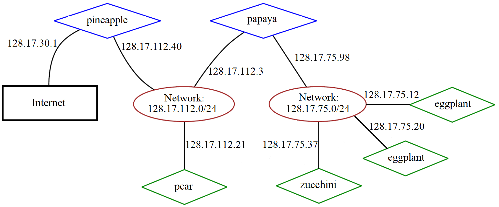

## Routing. Example.



Let's take a look (in the picture) at an example of an infrastructure with multiple subnets.

As you can see in the example below, the first entry (line) is for network *128.17.75.0/24*, all packets for this network will be sent to gateway *128.17.75.20*, which is the IP address of the host itself.
The second entry is the default route, which is applied to all packets sent in the network, not specified in this routing table. Here the route is via host papaya (IP *128.17.75.98*), which is like a door to the outside world. This route must be written on all machines of the *128.17.75.0/24* network, which must have access to other networks. The third entry is created for the loopback interface. This address is used if the machine needs to connect to itself via **TCP/IP**.

The last entry in the routing table is for IP *128.17.75.20* and is routed to the lo interface, so if the machine connects to itself on *128.17.75.20*, all packets will be sent to *127.0.0.1* interface.

An example of a routing table for an eggplant host:
```
[root@eggplant ~]# netstat -rn
Kernel IP routing table
Destination     Gateway         Genmask         Flags   MSS Window  irtt Iface
128.17.75.0      128.17.75.20   255.255.255.0   UN        1500 0          0 eth0
default          128.17.75.98   0.0.0.0         UGN       1500 0          0 eth0
127.0.0.1        127.0.0.1      255.0.0.0       UH        3584 0          0 lo
128.17.75.20     127.0.0.1      255.255.255.0   UH        3584 0          0 lo
```

If the eggplant host wishes to send a packet to the zucchini host, (the packet will therefore contain a sender -*128.17.75.20* and a destination - *128.17.75.37*), the IP protocol will determine based on the routing table that both hosts belong to the same network and will send the packet directly to the network where zucchini will receive it.
To be more specific, the network interface controller broadcasts an **ARP** request - "Who is IP *128.17.75.37*? This is *128.17.75.20* screaming".

All machines that receive this message ignore it, and the host with address *128.17.75.37* replies "That's me and my MAC address is such-and-such...",
then they connect and exchange data based on **ARP** tables where IP-MAC addresses are matched. "Screams", meaning this packet is being sent to all hosts. This happens because the MAC address of the recipient is specified as a broadcast address (*FF:FF:FF:FF:FF:FF:FF*).
Such packets are received by all network hosts.

Let's consider a situation where a host eggplant wants to send a packet to a pear host, for example, or even further away?
In this case, the destination of the packet will be - *128.17.112.21*, the IP protocol will try to find a route for *128.17.112* in the routing table, but this route is not there, so it will choose the default route, the gateway of which is papaya (*128.17.75.98*).


After receiving the packet, papaya will look up the destination address in its routing table:
```
[root@papaya ~]# netstat -rn
Kernel IP routing table
Destination     Gateway         Genmask         Flags   MSS Window  irtt Iface
128.17.75.0      128.17.75.98   255.255.255.0   UN        1500 0          0 eth0
128.17.112.0     128.17.112.3   255.255.255.0   UN        1500 0          0 eth1
default          128.17.112.40  0.0.0.0         UGN       1500 0          0 eth1
127.0.0.1        127.0.0.1      255.0.0.0       UH        3584 0          0 lo
128.17.75.98     127.0.0.1      255.255.255.0   UH        3584 0          0 lo
128.17.112.3     127.0.0.1      255.255.255.0   UH        3584 0          0 lo
```

In this example, you can see that papaya is connected to two networks: *128.17.75.0/24* via the eth0 device and *128.17.112* via the eth1 device.

The default route is via the pineapple host, which in its turn is the gateway to the external network.

Therefore, after receiving the pear packet, the papaya router will see that the destination address belongs to the *128.17.112* and will forward the packet according to the second entry in the routing table.

So, this is how packets are passed from router to router until they reach their destination address.

## **ICMP** protocol

The **ICMP** protocol is an error notification protocol.

The TCP/IP stack has a special messaging mechanism to allow routers to notify network nodes of errors or abnormal situations, called the Internet Control Message Protocol (**ICMP**).
