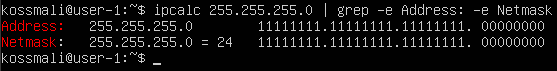
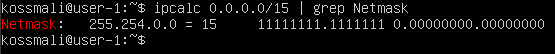

## Part 1. Инструмент ipcalc

1. Адрес сети: 192.160.0.0/13 

2. 255.255.255.0 в префиксной: /24   
255.255.255.0 
 двоичной: 11111111.11111111.11111111.00000000 
 
/15 в обычной: 255.254.0.0 
/15 в двоичной: 11111111.11111110.00000000.00000000 
 
11111111.11111111.11111111.11110000 в обычной: 255.255.255.240 
11111111.11111111.11111111.11110000 в префиксной: /28  
 
3. На скрине минимальные и максимальные хосты по заданным маскам  
 

### 1.2. localhost

Определить и записать в отчёт, можно ли обратиться к приложению, работающему на localhost, со следующими IP: 194.34.23.100, 127.0.0.2, 127.1.0.1, 128.0.0.1

### 1.3. Диапазоны и сегменты сетей

1. какие из перечисленных IP можно использовать в качестве публичного, а какие только в качестве частных: 10.0.0.45, 134.43.0.2, 192.168.4.2, 172.20.250.4, 172.0.2.1, 192.172.0.1, 172.68.0.2, 172.16.255.255, 10.10.10.10, 192.169.168.1

2. какие из перечисленных IP адресов шлюза возможны у сети 10.10.0.0/18: 10.0.0.1, 10.10.0.2, 10.10.10.10, 10.10.100.1, 10.10.1.255
